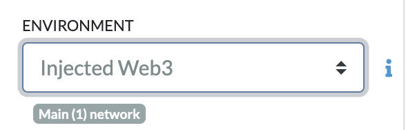
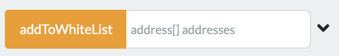

# F1 NFT Usage Documents

### Prerequisites 

- Setup and [Alchemy Account](https://www.alchemy.com/)
    - [Create Alchemy Key](https://docs.alchemy.com/alchemy/introduction/getting-started#1.create-an-alchemy-key) 
    - [Create an Ethereum API Key w/ Alchemy Video](https://www.youtube.com/watch?v=tfggWxfG9o0)

- Install [VSCode](https://code.visualstudio.com/download)
- [Optional] Create a [Github Account](https://github.com/)


### Deploy Contract
1. Navigate to `f1-nft` root directory
2. In the terminal type: ```touch .env``` to create the .env file
3. Put credentials is .env file
```
API_URL = "<ALECHEMY_URL"
API_KEY = "ALCHEMY_API_KEY"
PRIVATE_KEY = "PRIVATE_KEY"
IPFS_ENDPOINT =  "IPFS_ENDPOINT"
```
4. Compile Contract: ```npx hardhat compile```
5. Deploy Contract: ```npx hardhat deploy```
6. Write down address of the contract: 


## Invoke Smart Contract Functions

1. Navigate to `f1-nft` root directory
2. Go to https://remix.ethereum.org/
3. Create new file in default workspace: `F1_NFT.sol`. 
4. Copy and paste contents of `/contracts/F1_NFT.sol` into the newly created file on Remix 
5. Compile in Remix 
6. Go to Deploy and Run Transactions Tab
7. In the Environment Field, click the drop-down and choose `Injected Web3` 
8. Follow Prompts on MetaMask to Connect Account
9. Load in Deployed Contract. In the "At Address" block type in the contracts address and click. 
10. Interact with the Smart contract (See Below)


### Mint tokens 

 - Type in amount to mint

Example: 3

### Add to Whitelist 

 - Type in list of wallet addresses
Example: [0x5B38Da6a701c568545dCfcB03FcB875f56beddC4, 0xAb8483F64d9C6d1EcF9b849Ae677dD3315835cb2]

### Advance Phase 

 - Click

